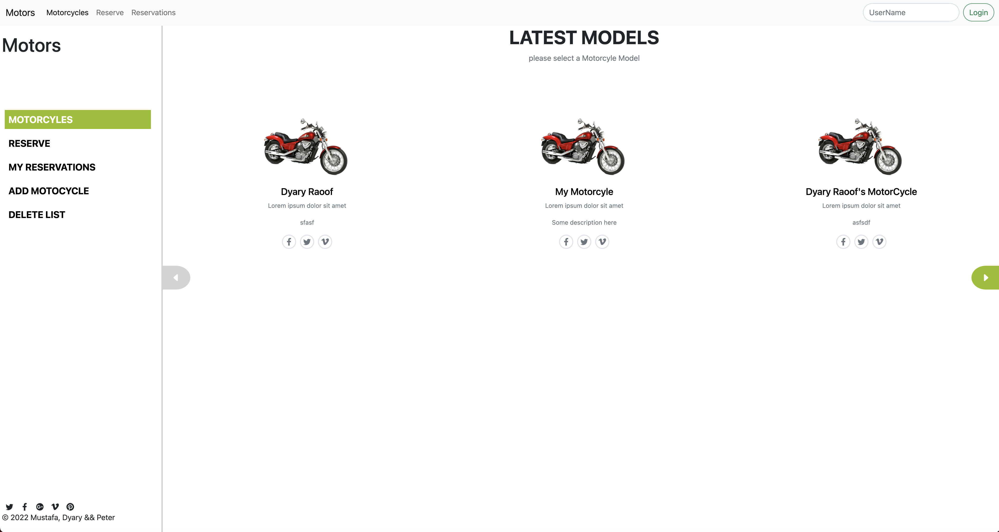
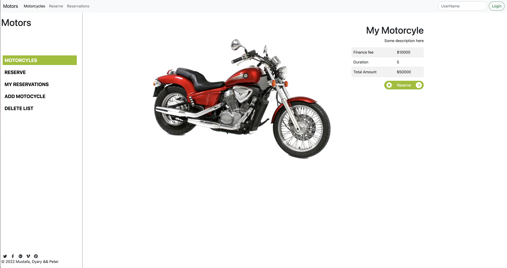

# Motors Frontend

This is a website that allows users to login, see list of motorcycle models, register a motorcycle or delete motorcycles, create reservations for motorcycles with city and date and see list of reservation. All of this is handled with react and redux and gets info from the back-end api. this project was built as the final capstone project for the Microverse full-stack developer curriculum.

## Built With

- React js
- Redux
- Bootstrap 
- Javascript
- CSS
- JSX
- Swipe JS

## Back End Repo
[Back End](https://github.com/DyaryRaoof/motors-backend)

## Live Demo
[Live Demo](https://motors-frontend-d-p-m.herokuapp.com/)

## Getting Started

- Clone the repository with `git clone` https://github.com/DyaryRaoof/motors-frontend;
- Open the cloned folder on the IDE of your choice;
- Install dependencies with `npm i`;
- Use `npm start` to start the website;

## Authors

👤 **Dyary Raoof Bayz**

- GitHub: [@DyaryRaoof](https://github.com/DyaryRaoof)
- Twitter: [@DyaryRaoof](https://twitter.com/DyaryRaoof)
- LinkedIn: [@DyaryRaoof](https://linkedin.com/in/DyaryRaoof)

👤 **Mustafa Abbas**

- GitHub: [@githubhandle](https://github.com/mustabbas)
- LinkedIn: [LinkedIn](https://www.linkedin.com/in/mustabbas/)

👤 **Ajayi Peter**

- GitHub: [@peterdgreat](https://github.com/peterdgreat)
- Twitter: [@dev_Peter_0](https://twitter.com/dev_Peter_O)
- LinkedIn: [ajayi-peter](https://linkedin.com/in/ajayi-peter-4391ab1b5)

## 🤝 Contributing

Contributions, issues, and feature requests are welcome!

Feel free to check the [issues page](../../issues/).

## Show your support

Give a ⭐️ if you like this project!

## Acknowledgments

- Hat tip to anyone whose code was used
- [Design](https://www.behance.net/gallery/26425031/Vespa-Responsive-Redesign) is provided by [Murat Korkmaz](https://github.com/DyaryRaoof/motors-backend)
- Microverse

## 📝 License

This project is [MIT](./MIT.md) licensed.
